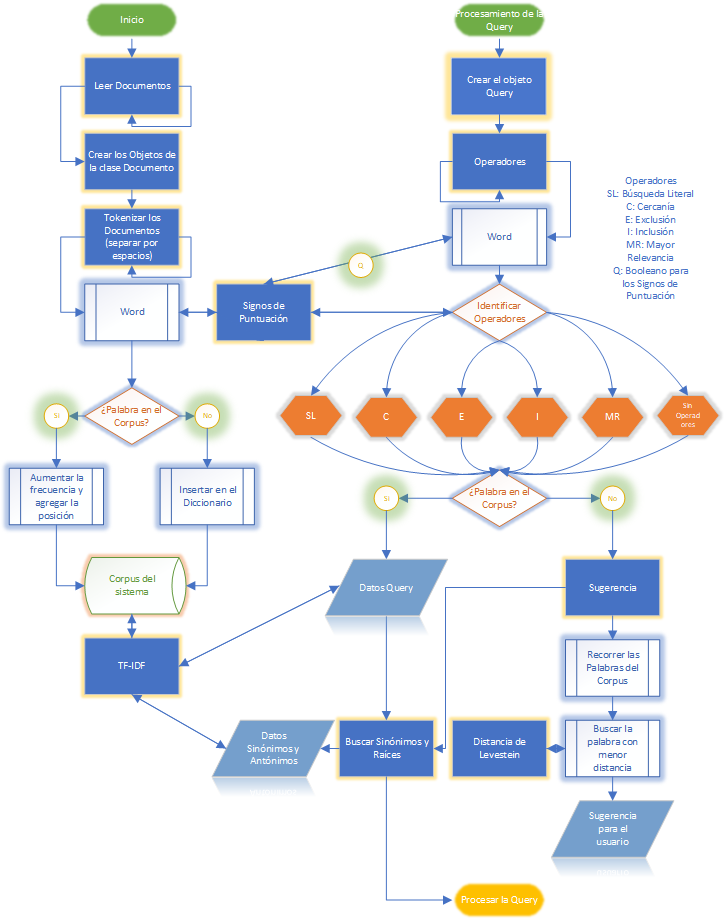
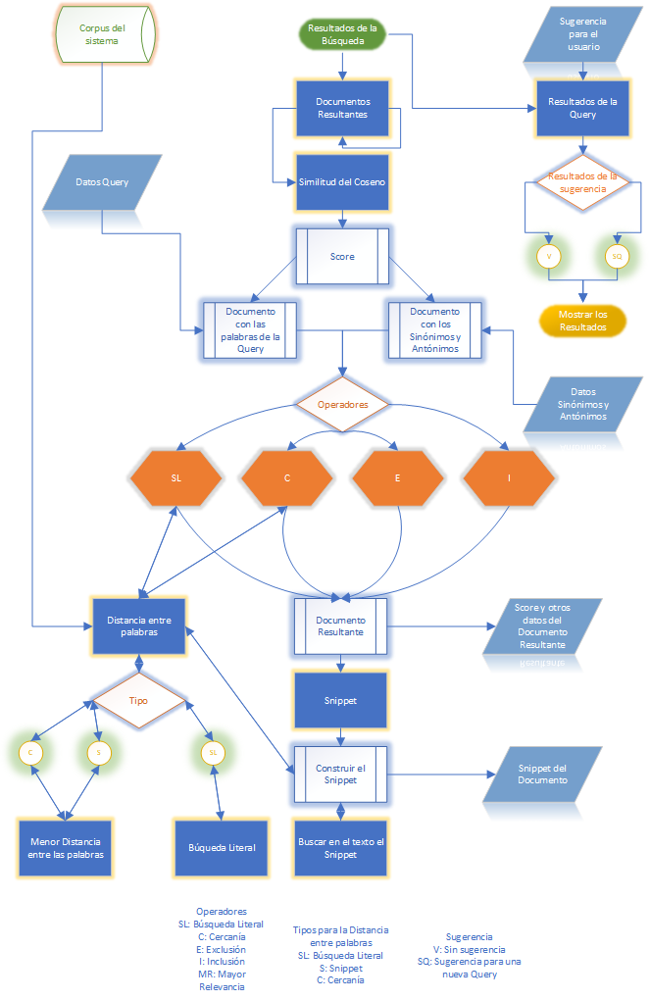

# Moogle!


> Proyecto de Programación I. Facultad de Matemática y Computación. Universidad de La Habana. Curso 2021.

>Raudel Alejandro Gómez Molina Grupo C111

## Descripción del Proyecto

### Algoritmos de Búsqueda

La búsqueda esta basada en el modelo vectorial de recuperación de la información *SRI*, utilizando el *TF-IDF* (frecuencia de término - frecuencia inversa de documento), el cual expresa la relevancia de una palabra asociada a un documento en una determinada colección, sumado a la *Similitud del Coseno*, método mediante el cual se asigna un *score* a cada document y se establece un ranking de resultados para el usuario.

### Operadores

El proyecto cuenta con varios operadores para mejorar la búsqueda del usuario:
- *Exclusión*, identificado con con un `!` delante de una palabra, (e.j., `!computación`)
 indica que `computación` **no debe aparecer en ningún documento devuelto**.
- *Inclusión*, identificado con con un `^` delante de una palabra, (e.j., `^computación`)
 indica que `computación` **debe aparecer en todos los documentos devueltos**.
- *Mayor Relevancia*, identificado por varios `*` delante de una palabra, (e.j., `*computación`) indica que `computación` es más relevante que las demás palabras de la *Query* tantas veces como `*` tenga delante de ella.
- *Cercanía* identificado con un `~` entre las palabras (e.j., `M~N~P`) indica que los documentos que contengan una ventana del texto con `M`, `N` y `P` tendran mayor *score*.
- *Búsqueda Literal*, identificado por un par de comillas `""` (e.j., `"Licenciatura en Ciencias de la Computación"`) indica que que el texto dentro de las comillas **debe aparecer literalmente en cada uno de los documentos devueltos**, si dentro del texto que está en las comillas aparece un `?` (e.j., `"Licenciatura en ? de la Computación"`) indica que **cualquier palabra puede aparecer en esa posición**.

### Sugerencia

Para brindar una mayor exactitud a la búsqueda, el proyecto cuenta con un corrector de palabras, el cual se encarga de dar una sugerencia al usuario en caso de que la búsqueda no sea del todo correcta para los datos almacenados.

### Resultados de la Búsqueda

Una vez rankeados los documentos, se le muestra al usuario una lista de los mismos, con el título y el *Snippet* donde se encontraron las palabras buscadas por este. Adicionalmente, se cuenta con la posibilidad de poder visualizar un fragmento más amplio del documento donde se hallaron los resultados, así como la opción de poder leer cualquier parte del documento.

### Ejecutando el proyecto

- Debes colocar los documentos en los que quieres desarrollar la búsqueda, en la carpeta
`Content`, en formato `.txt`.  

- Este proyecto está desarroyado para la versión objetivo de .NET Core 6.0. Para ejecutarlo solo te debes parar en la carpeta del proyecto y ejecutar en la terminal de Linux:

```bash
make dev
```

- Si estás en Windows, debes poder hacer lo mismo desde la terminal del WSL (Windows Subsystem for Linux), en caso contrario puedes ejecutar:

```bash
dotnet watch run --project MoogleServer
```

## Implementación Moogle Engine

Estructura de la biblioteca de clases `MoogleEngine`.

### Procesamineto de las palabras del Corpus

Al iniciar el servidor, se llama al método `Index_Corpus` de la clase `Moogle`, el cual se encarga de leer los documentos, y crear un objeto de la clase `Document` para cada documento de la carpeta `Content`:
- La clase `Document` se encarga de procesar el texto contenido dentro del documento, separar por espacios y eliminar los signos de puntuación (mediante el método `Sign_Puntuation`).
- En la clase `Corpus_Data` se almacena la información de cada una de las palabras en el diccionario `vocabulary` que tiene como valor un objeto de la clase `DataStructure` donde se guarda: la frecuencia y una lista de indices con las posiciones de la palabra en el documento (estructurando los vectores documento).
- Una vez terminado este proceso se calcula el *TF-IDF* de las palabras del corpus, mediante el método `Tf_IdfDoc` de la clase `Document`.

### Procesamiento de la Query 

Cuando el usuario introduce una nueva *Query* se crea un objeto de la clase `QueryClass` y en dicha clase se extraen las palabras de la *Query*:
- Se identifican los operadores de búsqueda mediante el método `Operators`. 
- Se agregó al proyecto un nuevo operador de búsqueda: *Búsqueda Literal*, cuya explicación aparece en la decripción del proyecto.
- Para el operador de cercanía se consideró la distancia entre *A~B~C* como la mínima ventana del texto que contiene a *A*, *B* y *C* en cualquier orden.
- Una vez identificados los operadores se procede a comprobar la existencia de las palabras de la *Query* en el corpus, en caso contrario, se llama al método `suggestion` donde se combina la *Distancia de Levenstein* con el peso de las palabras del Corpus y se construye la nueva *Query* donde está incluida la palabra sugerida.
- Para dar mejores resultados en la búsqueda al usuario se identifican las palabras que posean las mismas raíces o el mismo significado que las de la *Query*, mediante la clase `Snowball` que se encarga de realizar el stemming en español y la lista `synonymous` de la clase `Corpus_Data`, la cual contiene un diccionario de sinónimos para el español.
- Se procede a calcular el *TF-IDF* de las palabras de la *Query*.

### Resultados de la Búsqueda

Por cada documento se crea un objeto `Document_Result` y se analizan los requisitos de este con respecto a la búsqueda:
- Se comparan los datos de los vectores documento almacenados en `Corpus_Data`, con el vector consulta mediante el método `SimVectors` y se calcula el *Score* de cada documento teniendo en cuenta la influencia de los operadores mediante el método `ResultSearch`.
- Para tener en cuenta las condiciones de los operadores `Close` y `SearchLiteral`, se emplea la clase `Distance_Word` donde está el método `Shortest_Distance_Word` que devuelve la mínima distancia entre una lista de palabras en un determinado documento y el método `Literal` que se encarga de buscar en un documento y determinar la posición de las palabras que están especificadas en el operador `SearchLiteral`.
- Se construye el *Snippet* de cada uno de los docuemnto mediante el método `Snippet`, si hay resultados del operador `SearchLiteral` se muestra una línea por cada grupo de palabras de dicho operador. Por otro lado se define un tamaño máximo de 20 palabras para cada línea, luego se llama al método `Shortest_Distance_Word` de la clase `Distance_Word`, el cual determina el máximo número de palabras resultantes de la búsqueda que ocupan una ventana del texto de tamaño 20 y las posiciones en que estas se encuentran, si todas estas palabras no fueron contenidas en dicha ventana se realiza el mismo procedimiento con las restantes.
- Con las posiciones obtenidas en el método `Snippet`, se lee el documento y se guarda el texto contenido en dichas posiciones mediante el método `BuildSinipped`.
- Una vez concluida la búsqueda, se comprueba que la sugerencia hecha al usuario es válida y se construye el objeto `SearchResult` que devuelve el método `Query` de la clase `Moogle`, mediante una lista de objetos `SearchItem`, que adicionalmente, contiene un arreglo de *SnippetResult*, *Pos_SnippetResult* y *Words_not_result*, con las líneas del *Snippet*, las posiciones de dichas líneas en el documento y la lista de palabras de la *Query* que no fueron encontradas en el documento.

### Implementación para la mínima distancia entre un grupo de palabras

```cs
search_min_dist = new Queue<Tuple<int, int>>();
posList = new int[words.Count];
for (int i = 0; i < Pos_words_Sorted.Length; i++)
{
    search_min_dist.Enqueue(Pos_words_Sorted[i]);
    posList[Pos_words_Sorted[i].Item1]++;
    Tuple<bool, List<int>> all = AllContains(posList, j,ocurrence);
    if (all.Item1)
    {
        //Si la cantidad de palabras correcta esta en la cola tratamos de ver cuantas 
        //podemos sacar
        list_aux = all.Item2;
        while (true)
        {
            //Buscamos la posible palabra a eliminar de la cola
            Tuple<int, int> eliminate = search_min_dist.Peek();
            posList[eliminate.Item1]--;
            Tuple<bool, List<int>> tuple = AllContains(posList, j, ocurrence);
            if (tuple.Item1)
            {
                //Si la cantidad de palabras correctas en la cola no se altera sacamos la
                //palabra de la cola
                list_aux = tuple.Item2;
                search_min_dist.Dequeue();
            }
            else
            {
                posList[eliminate.Item1]++;
                break;
            }
        }
        //Comprobamos si la distancia obtenida es menor que la q teniamos
        if (Pos_words_Sorted[i].Item2 - search_min_dist.Peek().Item2 + 1 < minDist)
        {
            index_words_in_range = list_aux;
            minDist = Pos_words_Sorted[i].Item2 - search_min_dist.Peek().Item2 + 1;
            pos = search_min_dist.Peek().Item2;
        }
        if (Pos_words_Sorted[i].Item2 - search_min_dist.Peek().Item2 + 1 == minDist)
        {
            Random random = new Random();
            if (random.Next(2) == 0)
            {
                index_words_in_range = list_aux;
                pos = search_min_dist.Peek().Item2;
            }
        }
    }
}
```

## Implementación Moogle Server 

Se añadió al proyecto una nueva página `Doc.razor`, donde se le brinda al usuario la opción de poder visualizar el documento directamente desde el navegador.

### Autocompletar

- Para el autocompletamiento se añadó el evento `bind:event="oninput"` el cual permite actualizar el valor del string `query` cada vez que el usuario teclea o borra un nuevo carácter
- Se empleó el evento `onkeyup` que llama al método `Press`, el cual identifica la última porción de palabra tecleada por el usuario y llama al método `AutoComplete` de la clase `Server` el cual devuelve como máximo las 5 palabras del corpus más cercanas a completar el texto escrito por el usuario.
- Una vez obtenidas las palabras para autocompletar se utiliza un `datalist` para mostrarselas al usuario.

### Suggestion

- Se utilizó el evento `onclick` que llama al método `Suggestion` el cual permite realizar una nueva consulta con la query `suggestion`.

### Visualizar el Documento

- Cada etiqueta `Tittle` y `Snippet` contiene un enlace a la página `Doc.razor`, la cual recive como parámetros el título del documento, la posición de la línea y la página donde se encuentra el *Snippet*.
- La página `Doc.razor` llama al método `Read` de la clase `Server` el cual devuelve las 100 líneas de la página del documento que se quiere mostrar. Además está implmentada la posibilidad de visualizar la página anterior, la siguiente y cualquier página del documento a la que quiera acceder el usuario.

# Diagrama de Flujo


