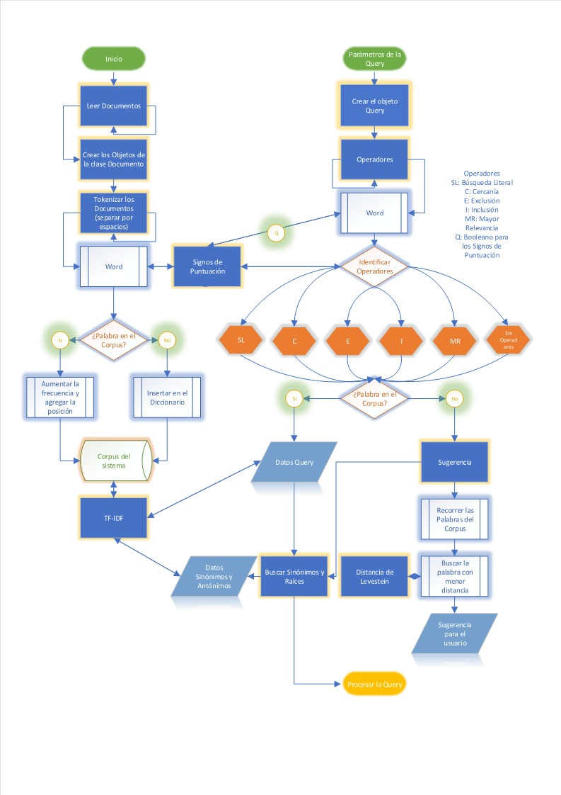
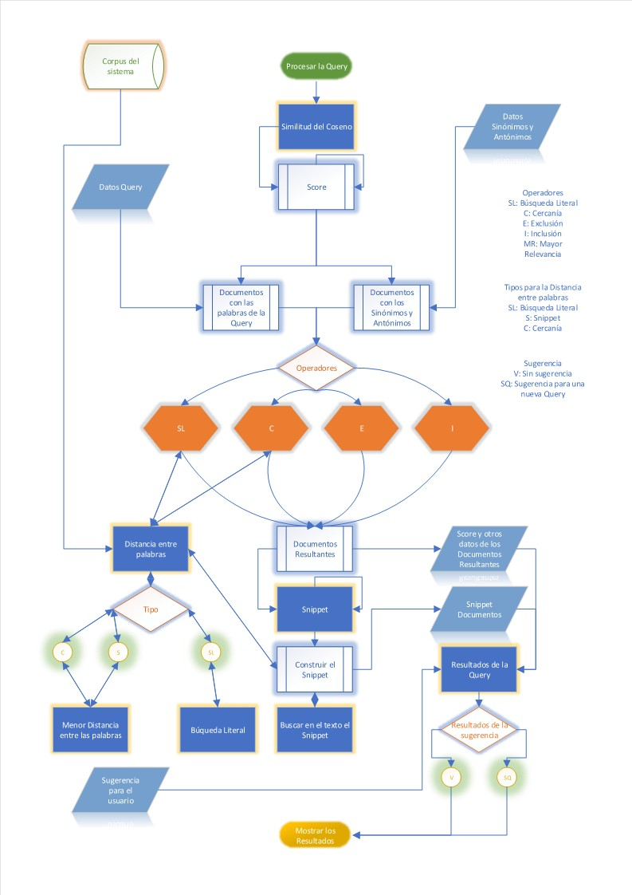

# Moogle!

> Proyecto de Programación I. Facultad de Matemática y Computación. Universidad de La Habana. Curso 2021.

>Raudel Alejandro Gómez Molina Grupo C111

## Implementación en MoogleEngine

Estructura de la biblioteca de clases `MoogleEngine`.

### Procesamineto de las palabras del Corpus

- El proyecto cuenta con un método `Index_Corpus` de la clase `Moogle`, el cual se encarga de leer los documentos, y crear un objeto de la clase `Document` para cada documento de la carpeta `Content`.
- La clase `Document` se encarga de procesar el texto contenido dentro del documento, separar por espacios y eliminar los signos de puntuación.
- En la clase `Corpus_Data` se almacena la información de cada una de las palabras en el diccionario `vocabulary` que tiene como valor un objeto de la clase `DataStructure` donde se guarda: la frecuencia y una lista de indices con las posiciones de la palabra en el documento (estructurando los vectores documento).
- Una vez terminado este proceso se calcula el *TF-IDF* de las palabras del corpus, mediante el método `Tf_IdfDoc` de la clase `Document`.

### Procesamiento de la Query 

- Cuando el usuario introduce una nueva *Query* se crea un objeto de la clase `QueryClass` y en dicha clase se extraen las palabras de la *Query*.
- Se identifican los operadores de búsqueda mediante el método `Operators`: se agregó al proyecto un nuevo operador de búsqueda, identificado por un par de comillas `""` (e.j., `"Licenciatura en Ciencias de la Computación"`) indica que que el texto dentro de las comillas **debe aparecer literalmente en cada uno de los documentos devueltos**, si dentro del texto que está en las comillas aparece un `?` (e.j., `"Licenciatura en ? de la Computación"`) indica que **cualquier palabra puede aparecer en esa posición**.
- Una vez identificados los operadores se procede a comprobar la existencia de las palabras de la *Query* en el corpus, en caso contrario, se llama al método `suggestion` donde se combina la *Distancia de Levenstein* con el peso de las palabras del Corpus y se construye la nueva *Query* donde está incluida la palabra sugerida.
- Para dar mejores resultados en la búsqueda al usuario se identifican las palabras que posean las mismas raíces o el mismo significado que las de la *Query*, mediante la clase `Snowball` que se encarga de realizar el stemming en español y la lista `synonymous` de la clase `Corpus_Data`, la cual contiene un diccionario de sinónimos para el español.
- Se procede a calcular el *TF-IDF* de las palabras de la *Query*.

### Resultados de la Búsqueda

- Se comparan los datos de los vectores documento almacenados en `Corpus_Data`, con el vector consulta mediante el método `SimVectors` y se calcula el *Score* de cada documento teniendo en cuenta la influencia de los operadores mediante el método `ResultSearch`.
- Para tener en cuenta las condiciones de los operadores `Close` y `SearchLiteral`, se emplea la clase `Distance_Word` donde está el método `Shortest_Distance_Word` que devuelve la mínima distancia entre una lista de palabras en un determinado documento y el método `Literal` que se encarga de buscar en un documento y determinar la posición de las palabras que están especificadas en el operador `SearchLiteral`.
- Se construye el *Snippet* de cada uno de los docuemnto mediante el método `Snippet`, si hay resultados del operador `SearchLiteral` se muestra una línea por cada grupo de palabras de dicho operador. Por otro lado se define un tamaño máximo de 20 palabras para cada línea, luego se llama al método `Shortest_Distance_Word` de la clase `Distance_Word`, el cual determina el máximo número de palabras resultantes de la búsqueda que ocupan una ventana del texto de tamaño 20 y las posiciones en que estas se encuentran, si todas estas palabras no fueron contenidas en dicha ventana se realiza el mismo procedimiento con las restantes.
- Con las posiciones obtenidas en el método `Snippet`, se lee el documento y se guarda el texto contenido en dichas posiciones mediante el método `BuildSinipped`.
- Una vez concluida la búsqueda, se comprueba que la sugerencia hecha al usuario es válida y se construye el objeto `SearchResult` que devuelve el método `Query` de la clase `Moogle`, mediante un arreglo de objetos `SearchItem`, que adicionalmente, contiene un arreglo de *SnippetResult*, *Pos_SnippetResult* y *Words_not_result*, con las líneas del *Snippet*, las posiciones de dichas líneas en el documento y la lista de palabras de la *Query* que no fueron encontradas en el documento.

## Implementación en Moogle Server 

Se añadió al proyecto una nueva página `Doc.razor`, donde se le brinda al usuario la opción de poder visualizar el documento directamente desde el navegador.

### Autocompletar

- Para el autocompletamiento se añadó el evento `bind:event="oninput"` el cual permite actualizar el valor del string `query` cada vez que el usuario teclea o borra un nuevo carácter.
- Se empleó el evento `onkeyup` que llama al método `Press`, el cual identifica la última porción de palabra tecleada por el usuario y llama al método `AutoComplete` de la clase `Server` el cual devuelve como máximo las 5 palabras del corpus más cercanas a completar el texto escrito por el usuario.
- Una vez obtenidas las palabras para autocompletar se utiliza un `datalist` para mostrarselas al usuario.

### Suggestion

- Se utilizó el evento `onclick` que llama al método `Suggestion` el cual permite realizar una nueva consulta con la query `suggestion`.

### Visualizar el Documento

- Cada etiqueta `Tittle` y `Snippet` contiene un enlace a la página `Doc.razor`, la cual recive como parámetros el título del documento, la posición de la línea y la página donde se encuentra el *Snippet*.
- La página `Doc.razor` llama al método `Read` de la clase `Server` el cual devuelve las 100 líneas de la página del documento que se quiere mostrar. Además está implmentada la posibilidad de visualizar la página anterior, la siguiente y cualquier página del documento a la que quiera acceder el usuario.

## Diagrama de Flujo

